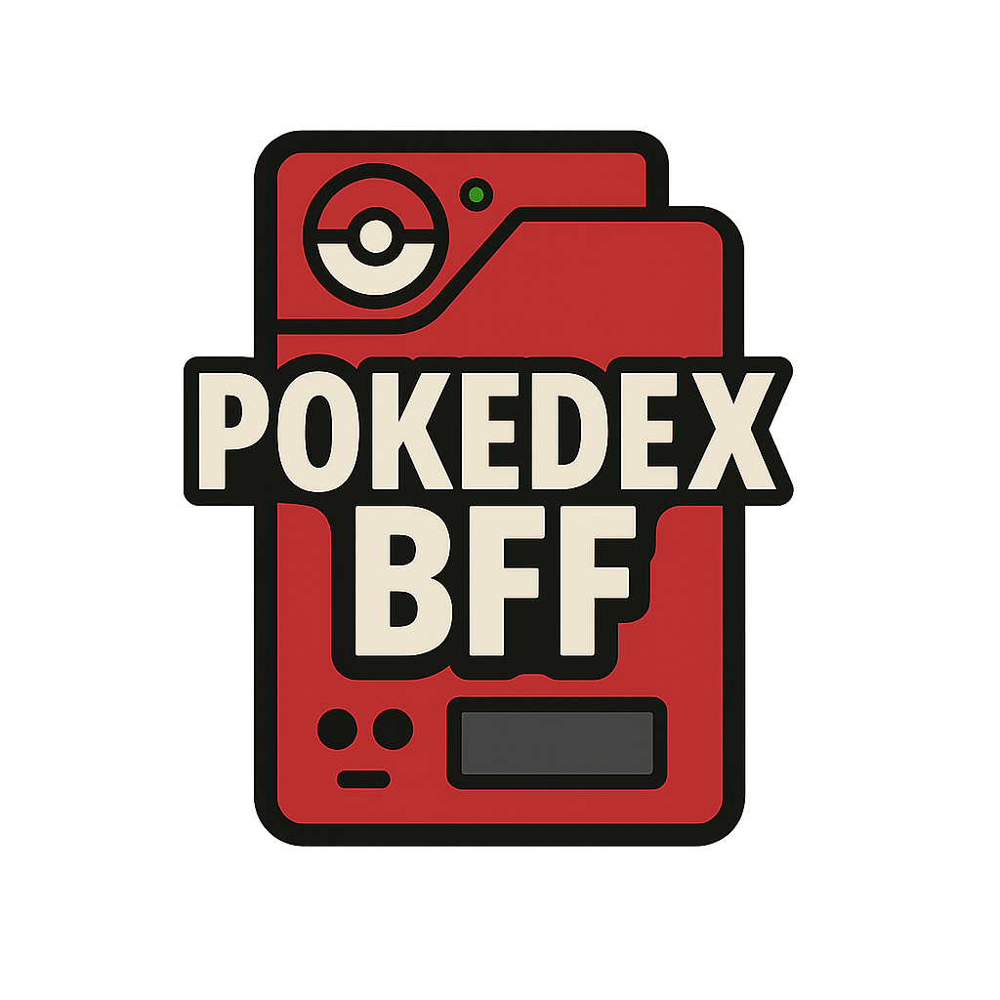

<p align="center">
  
</p>
<p align="center">
  
  
  
  
  
</p>

# Pokédex BFF - Backend for Frontend

## 🎯 **Visão Geral**

**Pokédex BFF** é um backend especializado que atua como intermediário entre aplicações frontend e múltiplas fontes de dados de Pokémon. Agora implementado com **DDD + Clean Architecture**, o projeto prioriza:
- **Alta coesão por contexto de negócio**
- **Separação clara entre domínio, aplicação, infraestrutura e interfaces**
- **Baixo acoplamento via abstrações e dependências invertidas**

## 📁 **Estrutura do Projeto (DDD + Clean Architecture)**

```
src/main/kotlin/com/pokedex/bff/
├── domain/           # Modelagem do negócio (core, sem dependências técnicas)
│   ├── pokemon/      # Agregado Pokémon: entidades, value objects, serviços, eventos, exceções, repositórios
│   ├── trainer/      # Agregado Trainer: entidades, value objects, exceções, repositórios
│   └── shared/       # Value objects e exceções compartilhadas
├── application/      # Casos de uso, orquestração e contratos de comunicação
│   ├── usecase/      # Interfaces dos casos de uso (input boundary)
│   ├── interactor/   # Implementações dos casos de uso (application service)
│   └── dtos/         # DTOs de entrada/saída
├── adapters/         # Interface com o mundo externo (entrada e saída)
│   ├── in/web/       # Controllers REST, DTOs REST, mappers
│   └── out/          # Persistência, integrações externas, mappers
├── infrastructure/   # Configuração técnica, wiring, segurança, migrações
│   ├── config/       # Beans/factories, configs Spring
│   ├── security/     # Configuração de segurança
│   └── migration/    # Scripts de migração
└── tests/            # Testes automatizados (unit, integration, e2e)
```

## 🏗️ **Arquitetura**

O projeto segue rigorosamente os princípios de **Domain-Driven Design (DDD)** e **Clean Architecture**:
- **Domain**: Núcleo puro do negócio, sem dependências técnicas
- **Application**: Orquestração de casos de uso, coordenação de entidades do domínio
- **Adapters**: Ponte entre aplicação/domínio e o mundo externo (REST, persistência, integrações)
- **Infrastructure**: Configurações técnicas, segurança, migrações

> Consulte a documentação em `doc/` para detalhes, exemplos e guias de cada camada.

## 🛠️ **Comandos de Desenvolvimento**

```bash
# Desenvolvimento local
./gradlew bootRun           # Inicia aplicação
./gradlew test              # Executa testes
./gradlew build             # Build completo
./gradlew bootJar           # Gera JAR executável
```

## 📚 **Documentação**
- [Visão Geral](doc/OVERVIEW.md)
- [Getting Started](doc/GETTING_STARTED.md)
- [Guia de Estilo](doc/development/STYLE_GUIDE.md)
- [Arquitetura e Princípios](doc/architecture/COMPONENT_PRINCIPLES.md)
- [Swagger/API](doc/api/SWAGGER.md)

---

> **Nota:** O projeto foi totalmente refatorado para DDD + Clean Architecture. Consulte os arquivos em `doc/` para exemplos, decisões e guias de migração.