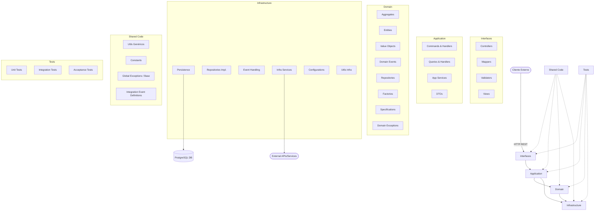
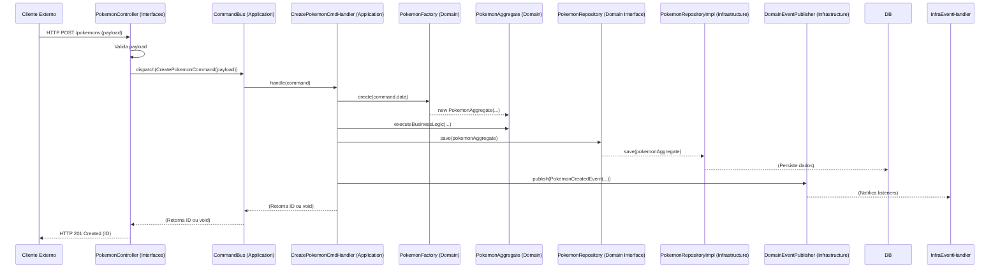
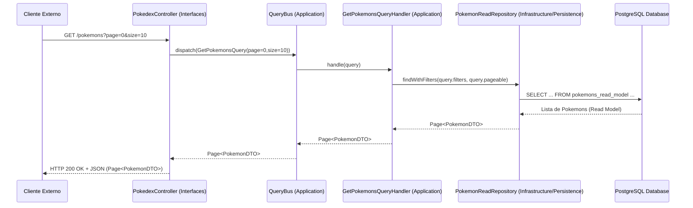

# Arquitetura do Sistema — Pokédex BFF

## 1. Visão Geral

O **Pokédex BFF** é um backend que fornece dados estruturados de Pokémon através de APIs REST.
A arquitetura é baseada em **Spring Boot** e Kotlin, organizada em camadas bem definidas para facilitar manutenção, testes e evolução, seguindo princípios de Design Orientado ao Domínio (DDD) e Arquitetura Limpa/Hexagonal de forma adaptada.

---

## 2. Objetivos Arquiteturais

* Separação clara de responsabilidades entre as camadas: interface, aplicação, domínio e infraestrutura.
* Alta coesão dentro das camadas e baixo acoplamento entre elas.
* Testabilidade facilitada para lógica de negócio (domínio) e serviços de aplicação.
* Evolução e manutenção simplificadas, permitindo substituição de tecnologias (ex: banco de dados, frameworks de UI) com mínimo impacto no núcleo do sistema.
* Pré-carga de dados via JSON para um banco de dados relacional.

---

## 3. Visão Geral da Arquitetura

A arquitetura é dividida nas seguintes camadas principais, com pacotes base localizados em `com.pokedex.bff` (dentro de `src/main/kotlin/` ou `src/test/kotlin/` para testes). A estrutura detalhada abaixo descreve uma arquitetura robusta e escalável, incorporando elementos de DDD, CQRS e Arquitetura Limpa. *Nota: Nem todos os diretórios listados podem estar presentes na implementação atual, mas representam a estrutura ideal ou recomendada.*

### Camadas e Componentes Detalhados

| Camada Principal   | Subcomponente/Diretório        | Responsabilidade                                                                                                                               |
| :----------------- | :----------------------------- | :--------------------------------------------------------------------------------------------------------------------------------------------- |
| **Interfaces**     | `controllers/`                 | Recebe requisições HTTP, delega para a camada de Aplicação. Lida com a apresentação dos dados (ex: JSON).                                        |
|                    | `views/`                       | (Opcional para BFFs puros) Renderização de templates no servidor, se aplicável.                                                                 |
|                    | `mappers/`                     | Mapeamento entre DTOs da Aplicação e modelos de visualização ou formatos de resposta específicos da interface.                                       |
|                    | `validators/`                  | Validação de dados de entrada específicos da interface (ex: formato de requisição).                                                              |
| **Application**    | `services/`                    | Orquestra casos de uso, coordena a lógica de aplicação. Pode usar Command Handlers e Query Handlers. (Observado: `PokedexService.kt`)        |
|                    | `commands/`                    | Definições de Comandos (intenções de mudança de estado) e seus Handlers.                                                                       |
|                    | `queries/`                     | Definições de Consultas (solicitações de dados) e seus Handlers.                                                                               |
|                    | `dto/`                         | Objetos de Transferência de Dados usados para comunicação entre camadas (ex: entrada para Comandos, saída de Consultas). (Observado)             |
| **Domain**         | `aggregates/`                  | Raízes de Agregação, que são clusters de entidades e VOs tratados como uma unidade. Contêm a lógica de negócio central.                         |
|                    | `entities/`                    | Objetos de domínio com identidade e ciclo de vida. (Observado: `PokemonEntity.kt`, etc.)                                                        |
|                    | `valueobjects/`                | Objetos que representam um valor descritivo sem identidade. (Observado em `application/`, movido para `domain/` conceitualmente)                |
|                    | `events/`                      | Eventos de Domínio que capturam ocorrências significativas dentro do domínio.                                                                   |
|                    | `exceptions/`                  | Exceções específicas do domínio.                                                                                                               |
|                    | `factories/`                   | Lógica para criação complexa de objetos de domínio (Entidades, Agregados).                                                                     |
|                    | `repositories/`                | Interfaces que definem contratos para persistência de Agregados/Entidades. (Observado: `PokemonRepository.kt` interface)                       |
|                    | `specifications/`              | Lógica de consulta de domínio reutilizável e combinável.                                                                                       |
| **Infrastructure** | `repositories/`                | Implementações concretas das interfaces de Repositório do Domínio (ex: usando Spring Data JPA).                                                  |
|                    | `persistence/`                 | Configuração de ORM, migrações de banco de dados, scripts de seed. (Observado: `seeder/`)                                                       |
|                    | `events/`                      | Implementação de publicação e subscrição de eventos (ex: message brokers, event bus local).                                                      |
|                    | `services/`                    | Clientes para serviços externos (ex: APIs de terceiros, gateways de email), serviços de infraestrutura (ex: sistema de arquivos).                |
|                    | `configurations/`              | Configurações do framework (Spring), segurança, CORS, OpenAPI. (Observado)                                                                     |
|                    | `utils/`                       | Utilitários específicos da infraestrutura (ex: `JsonFile.kt` para seeders). (Observado)                                                          |
| **Shared**         | `utils/`                       | Utilitários genéricos e reutilizáveis em múltiplas camadas (ex: manipulação de strings, datas).                                               |
|                    | `constants/`                   | Constantes globais da aplicação.                                                                                                               |
|                    | `events/`                      | (Opcional) Definições de eventos de integração ou tipos de eventos compartilhados, se não específicos do domínio.                                |
|                    | `exceptions/`                  | Exceções compartilhadas ou handlers globais. (Observado: `GlobalExceptionHandler.kt`)                                                          |
| **Tests**          | `unit/`                        | Testes unitários para classes individuais em isolamento.                                                                                       |
|                    | `integration/`                 | Testes de integração entre múltiplos componentes ou camadas (ex: serviço com repositório, controller com serviço).                             |
|                    | `acceptance/`                  | Testes de ponta a ponta que verificam o comportamento do sistema da perspectiva do usuário/cliente.                                            |
|                    | `mocks/`                       | Mocks, stubs ou fakes reutilizáveis para testes.                                                                                               |

---

## 4. Fluxo Principal (Exemplo com CQRS: Comando para Criar Pokémon)

1.  **Cliente Externo** faz uma requisição HTTP POST para `Interfaces/Controllers/PokemonController`.
2.  O `Controller` valida a requisição e usa um `Interfaces/Mappers` para converter o payload em um `Application/Commands/CreatePokemonCommand`.
3.  O `Controller` envia o `Comando` para um Command Bus ou diretamente para o `Application/Commands/CreatePokemonCommandHandler` correspondente.
4.  O `CommandHandler` (em `Application`):
    *   Pode usar `Domain/Factories` para criar instâncias de `Domain/Aggregates/PokemonAggregate` ou `Domain/Entities/PokemonEntity`.
    *   Aplica lógica de negócio contida no Agregado/Entidade.
    *   Usa uma interface de `Domain/Repositories/PokemonRepository` para persistir o novo Agregado/Entidade. A implementação concreta estará em `Infrastructure/Repositories/`.
    *   Pode disparar `Domain/Events/PokemonCreatedEvent` através de um Domain Event Publisher.
5.  `Infrastructure/Events/` (Listeners de Eventos de Domínio) podem reagir ao `PokemonCreatedEvent` para executar ações secundárias (ex: enviar notificação, atualizar read models).
6.  O `CommandHandler` retorna um resultado (ex: ID do Pokémon criado) ou void.
7.  O `Controller` retorna uma resposta HTTP apropriada (ex: 201 Created com o ID).

**(Exemplo com CQRS: Consulta para Obter Pokémon)**

1.  **Cliente Externo** faz uma requisição HTTP GET para `Interfaces/Controllers/PokemonController`.
2.  O `Controller` valida e converte os parâmetros da requisição em um `Application/Queries/GetPokemonQuery`.
3.  O `Controller` envia a `Consulta` para um Query Bus ou diretamente para o `Application/Queries/GetPokemonQueryHandler`.
4.  O `QueryHandler` (em `Application`):
    *   Interage diretamente com `Infrastructure/Persistence` (ex: usando uma view otimizada, Dapper, JDBC, ou mesmo repositórios se for um read model simples) para buscar os dados.
    *   Pode usar `Domain/Specifications` se a lógica de consulta for complexa e reutilizável, embora queries diretas sejam comuns para otimizar leituras.
    *   Mapeia os dados brutos para `Application/DTO/PokemonDTO`.
5.  O `QueryHandler` retorna o `PokemonDTO`.
6.  O `Controller` recebe o `DTO` e o serializa como resposta HTTP.

---

## 5. Tecnologias Utilizadas

* **Spring Boot:** Framework principal para APIs REST, injeção de dependências e configuração automática.
* **Kotlin:** Linguagem principal do projeto, rodando na JVM.
* **Spring Data JPA:** Para abstração e facilitação do acesso a dados relacionais (PostgreSQL) na camada de Infrastructure (implementação de repositórios).
* **PostgreSQL:** Banco de dados relacional robusto e extensível.
* **Jackson:** Para serialização/deserialização de JSON.
* **SLF4J + Logback:** Para logging estruturado e flexível.
* **Gradle:** Ferramenta de automação de build e gerenciamento de dependências.
* **OpenAPI (via Springdoc):** Para documentação automática de API (configurado em `Infrastructure/Configurations/OpenApiConfiguration.kt`).
* **(Potencialmente) Spring MediatR/Axon Framework:** Para implementações de Command/Query Bus e Domain Events.

---

## 6. Padrões e Boas Práticas

* **Design Orientado ao Domínio (DDD):** Foco em modelar o núcleo do negócio (Agregados, Entidades, Value Objects, Eventos de Domínio, Repositórios, Fábricas, Especificações).
* **Command Query Responsibility Segregation (CQRS):** Separação de operações que alteram estado (Comandos) das que leem estado (Consultas). Isso permite otimizar cada lado independentemente.
* **Arquitetura Limpa/Hexagonal:** Camadas bem definidas com dependências apontando para o interior (Domain é o centro). Interfaces (portas) no domínio e adaptadores na infraestrutura.
* **Inversão de Dependência (DIP):** Camadas de alto nível dependem de abstrações, não de implementações.
* **DTOs para Contratos:** DTOs são usados para comunicação entre a camada de Aplicação e as camadas externas (Interfaces, Infrastructure para eventos).
* **Imutabilidade:** Preferir objetos imutáveis, especialmente Value Objects e DTOs.
* **Testes Abrangentes:** Cobertura com testes unitários, de integração e de aceitação.

---

## 7. Detalhes Técnicos por Camada (Expandido)

A estrutura de pacotes sugerida para `com.pokedex.bff` seria:

### 7.1 Interfaces (`com.pokedex.bff.interfaces`)

*   **`controllers/`**:
    *   Responsabilidade: Lidar com requisições HTTP, desserializar payloads, chamar a camada de Aplicação (Comandos/Consultas), serializar respostas.
    *   Exemplo: `PokemonController.kt` (Observado).
*   **`views/`**:
    *   Responsabilidade: (Se aplicável) Renderização de Server-Side Templates. Menos comum para BFFs puros que servem JSON.
*   **`mappers/`**:
    *   Responsabilidade: Transformar DTOs da camada de Aplicação em modelos de view ou formatos de resposta HTTP específicos, ou vice-versa para dados de entrada.
*   **`validators/`**:
    *   Responsabilidade: Validação de dados de entrada no nível da interface (ex: usando Bean Validation com anotações em DTOs de entrada).

### 7.2 Application (`com.pokedex.bff.application`)

*   **`services/`**:
    *   Responsabilidade: Orquestrar casos de uso mais complexos que podem envolver múltiplos comandos ou consultas, ou lógica de aplicação que não se encaixa em um Command/Query Handler simples. (Observado: `PokedexService.kt` pode ser refatorado para usar Comandos/Consultas).
*   **`commands/`**:
    *   Responsabilidade: Contém definições de Comandos (objetos imutáveis representando uma intenção de mudar o estado do sistema) e seus respectivos Handlers (classes que processam um tipo de Comando).
    *   Exemplo: `CreatePokemonCommand.kt`, `CreatePokemonCommandHandler.kt`.
*   **`queries/`**:
    *   Responsabilidade: Contém definições de Consultas (objetos imutáveis representando uma solicitação de dados) e seus Handlers (classes que processam uma Consulta e retornam DTOs).
    *   Exemplo: `GetPokemonByIdQuery.kt`, `GetPokemonByIdQueryHandler.kt`, retornando `PokemonDetailsDTO.kt`.
*   **`dto/`**:
    *   Responsabilidade: Objetos de Transferência de Dados para comunicação entre camadas. Usados como parâmetros para Comandos, entrada para Consultas e como dados de retorno de Consultas/Serviços. (Observado)

### 7.3 Domain (`com.pokedex.bff.domain`)

*   **`aggregates/`**:
    *   Responsabilidade: Raízes de Agregação e suas entidades internas. Um Agregado é uma unidade transacional e de consistência que encapsula lógica de negócio complexa.
    *   Exemplo: `PokemonAggregate.kt` (poderia conter `PokemonEntity` e `StatsEntity` como parte do mesmo agregado).
*   **`entities/`**:
    *   Responsabilidade: Objetos de domínio com identidade que não são raízes de agregado, mas fazem parte de um. Se não usar o conceito de Agregado explicitamente, esta pasta contém as entidades principais. (Observado: `PokemonEntity.kt`, `TypeEntity.kt`).
*   **`valueobjects/`**:
    *   Responsabilidade: Objetos imutáveis que descrevem características de entidades ou agregados, sem identidade própria (ex: `Money.kt`, `Address.kt`, `SpriteDetailsVO.kt`). (Observado em `application/`, conceitualmente melhor aqui).
*   **`events/`**:
    *   Responsabilidade: Eventos de Domínio que representam algo significativo que aconteceu no domínio.
    *   Exemplo: `PokemonRegisteredEvent.kt`, `PokemonStatsUpdatedEvent.kt`.
*   **`exceptions/`**:
    *   Responsabilidade: Exceções específicas do domínio que representam violações de regras de negócio.
    *   Exemplo: `InvalidPokemonStatsException.kt`.
*   **`factories/`**:
    *   Responsabilidade: Encapsular a lógica de criação de Agregados ou Entidades complexas, garantindo que sejam criados em um estado válido.
    *   Exemplo: `PokemonFactory.kt`.
*   **`repositories/`**:
    *   Responsabilidade: Interfaces (contratos) para persistência de Agregados/Entidades. Abstraem a tecnologia de persistência. (Observado: `PokemonRepository.kt` como interface).
*   **`specifications/`**:
    *   Responsabilidade: Encapsular lógica de consulta de domínio de forma reutilizável e combinável, expressando critérios de seleção.
    *   Exemplo: `HighAttackPokemonSpecification.kt`.

### 7.4 Infrastructure (`com.pokedex.bff.infrastructure`)

*   **`repositories/`**:
    *   Responsabilidade: Implementações concretas das interfaces de `Domain/Repositories/`, geralmente usando um ORM como Spring Data JPA.
    *   Exemplo: `PostgresPokemonRepositoryImpl.kt` (nome hipotético).
*   **`persistence/`**:
    *   Responsabilidade: Configurações de persistência (ex: EntityManager, DataSources), scripts de migração de banco de dados (ex: Flyway, Liquibase), e lógica de seed de dados. (Observado: `seeder/` se encaixa aqui).
*   **`events/`**:
    *   Responsabilidade: Implementação da infraestrutura para publicação e consumo de eventos (ex: configuração de um Message Broker como Kafka/RabbitMQ, ou um EventBus síncrono/assíncrono local).
*   **`services/`**:
    *   Responsabilidade: Implementações de clientes para serviços externos (ex: cliente HTTP para uma API de terceiros, serviço de envio de email) ou outros serviços de infraestrutura.
*   **`configurations/`**:
    *   Responsabilidade: Configurações do Spring Boot, segurança, CORS, serialização JSON, OpenAPI, etc. (Observado).
*   **`utils/`**:
    *   Responsabilidade: Utilitários específicos para a camada de infraestrutura (ex: `JsonFile.kt` usado pelo seeder). (Observado).

### 7.5 Shared (`com.pokedex.bff.shared`)

*   **`utils/`**:
    *   Responsabilidade: Utilitários verdadeiramente genéricos, sem dependências de outras camadas, que podem ser usados em qualquer lugar.
*   **`constants/`**:
    *   Responsabilidade: Constantes globais da aplicação (ex: nomes de filas, chaves de configuração).
*   **`events/`**:
    *   Responsabilidade: (Opcional) Definições de eventos de integração que cruzam contextos delimitados, ou tipos de eventos base.
*   **`exceptions/`**:
    *   Responsabilidade: Classes base para exceções, handlers globais de exceção. (Observado: `GlobalExceptionHandler.kt`).

### 7.6 Tests (`src/test/kotlin/com.pokedex.bff`)

A estrutura de testes deve espelhar a estrutura de `src/main/kotlin/` para clareza, organizada por tipo de teste:
*   **`unit/`**: Testes para classes individuais, focando em sua lógica interna. Mocks/Stubs para dependências externas.
    *   Ex: `unit/domain/entities/PokemonEntityTest.kt`, `unit/application/commands/CreatePokemonCommandHandlerTest.kt`.
*   **`integration/`**: Testes que verificam a colaboração entre múltiplas classes/componentes. Podem envolver um banco de dados em memória ou Testcontainers.
    *   Ex: `integration/application/PokemonAppServiceIntegrationTest.kt` (testando um serviço de aplicação com seu repositório real ou mockado).
    *   Ex: `integration/infrastructure/repositories/PokemonRepositoryIntegrationTest.kt` (testando a implementação do repositório com o banco).
*   **`acceptance/` (ou `e2e/`)**: Testes de ponta a ponta que simulam o comportamento do usuário/cliente, geralmente fazendo requisições HTTP aos controllers e verificando as respostas.
    *   Ex: `acceptance/interfaces/controllers/PokemonControllerAcceptanceTest.kt`.
*   **`mocks/`**: (Opcional) Utilitários para criar mocks, stubs ou classes de teste fakes que podem ser reutilizadas.

*Nota: A implementação real pode começar com uma estrutura mais simples e evoluir para esta forma mais detalhada conforme a complexidade do projeto aumenta.*

---

## 8. Estrutura de Pastas (Idealizada e Detalhada)

```plaintext
com.pokedex.bff
├── application
│   ├── commands      // Comandos e Handlers (ex: CreatePokemonCommand.kt, CreatePokemonCommandHandler.kt)
│   ├── dto           // DTOs para entrada/saída da camada de aplicação (ex: PokemonDTO.kt) (Observado)
│   ├── queries       // Consultas e Handlers (ex: GetPokemonByIdQuery.kt, GetPokemonByIdQueryHandler.kt)
│   └── services      // Serviços de aplicação para orquestração (Observado: PokedexService.kt)
│
├── domain
│   ├── aggregates    // Raízes de Agregação (ex: PokemonAggregate.kt)
│   ├── entities      // Entidades do domínio (Observado: PokemonEntity.kt)
│   ├── events        // Eventos de Domínio (ex: PokemonRegisteredEvent.kt)
│   ├── exceptions    // Exceções de Domínio (ex: InvalidStatsException.kt)
│   ├── factories     // Fábricas para criar objetos de domínio (ex: PokemonFactory.kt)
│   ├── repositories  // Interfaces de Repositório (Observado: PokemonRepository.kt)
│   ├── specifications// Especificações de consulta de domínio
│   └── valueobjects  // Value Objects (Observado em application/, movido para cá: SpritesVO.kt)
│
├── infrastructure
│   ├── configurations// Configurações do Spring, Segurança, OpenAPI (Observado)
│   ├── events        // Implementação de Event Bus/Message Broker consumers/producers
│   ├── persistence   // Configs de ORM, Migrações, Seeders (Observado: seeder/)
│   ├── repositories  // Implementações de Repositório (ex: PostgresPokemonRepository.kt)
│   ├── services      // Clientes para serviços externos, etc.
│   └── utils         // Utilitários de infraestrutura (Observado: JsonFile.kt)
│
├── interfaces
│   ├── controllers   // Controllers REST (Observado: PokedexController.kt)
│   ├── mappers       // Mapeadores para DTOs <-> Modelos de View/Resposta
│   ├── validators    // Validadores de entrada da interface
│   └── views         // (Opcional) Server-side templates
│
├── shared            // Código compartilhado entre camadas
│   ├── constants     // Constantes globais
│   ├── events        // (Opcional) Definições de eventos de integração
│   ├── exceptions    // Exceções base, GlobalExceptionHandler (Observado)
│   └── utils         // Utilitários genéricos
│
└── Application.kt    // Ponto de entrada do Spring Boot

src/test/kotlin/com/pokedex/bff
├── unit              // Testes unitários (espelhando a estrutura do main)
│   ├── application
│   │   └── commands
│   └── domain
│       └── aggregates
├── integration       // Testes de integração
│   ├── infrastructure
│   │   └── repositories
│   └── application
├── acceptance        // Testes de aceitação/E2E
│   └── interfaces
│       └── controllers
└── mocks             // Mocks e utilitários de teste
```

---

## 9. Diagrama de Componentes (Visão Geral com Foco em CQRS e DDD)



---

## 10. Diagrama de Sequência (Exemplo: Comando para Criar Pokémon)



**(Exemplo: Consulta para Listar Pokémons)**


---
