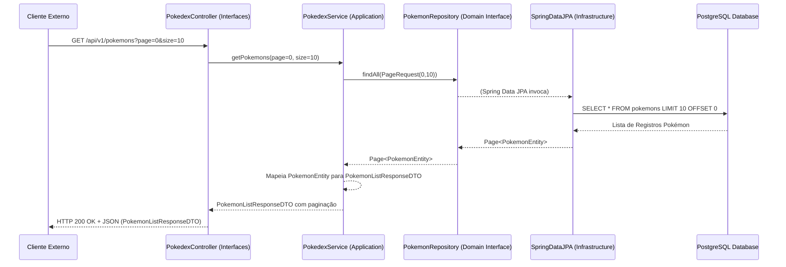

# Arquitetura do Sistema — Pokédex BFF

## 1. Visão Geral

O **Pokédex BFF** é um backend que fornece dados estruturados de Pokémon através de APIs REST.
A arquitetura é baseada em **Spring Boot** e Kotlin, organizada em camadas bem definidas para facilitar manutenção, testes e evolução, seguindo princípios de Design Orientado ao Domínio (DDD) e Arquitetura Limpa/Hexagonal de forma adaptada.

---

## 2. Objetivos Arquiteturais

* Separação clara de responsabilidades entre as camadas: interface, aplicação, domínio e infraestrutura.
* Alta coesão dentro das camadas e baixo acoplamento entre elas.
* Testabilidade facilitada para lógica de negócio (domínio) e serviços de aplicação.
* Evolução e manutenção simplificadas, permitindo substituição de tecnologias (ex: banco de dados, frameworks de UI) com mínimo impacto no núcleo do sistema.
* Pré-carga de dados via JSON para um banco de dados relacional.

---

## 3. Visão Geral da Arquitetura

A arquitetura é dividida nas seguintes camadas principais, com pacotes base localizados em `com.pokedex.bff`:

### Camadas

| Camada             | Responsabilidade                                                                                                | Pacote Base                                  |
| ------------------ | --------------------------------------------------------------------------------------------------------------- | -------------------------------------------- |
| **Interfaces**     | Expor a funcionalidade do sistema para o mundo externo. No caso, Controllers REST para requisições HTTP.        | `interfaces/controllers/`                    |
| **Application**    | Orquestrar os casos de uso do sistema. Contém a lógica de aplicação, coordena o domínio e a infraestrutura.       | `application/services/`                      |
|   ↳ DTOs           | Objetos de Transferência de Dados usados para comunicação entre a camada de Interface e a de Aplicação.         | `application/dto/`                           |
|   ↳ Value Objects  | Pequenos objetos que representam um valor simples, usados pela camada de Aplicação e, potencialmente, Domínio. | `application/valueobjects/`                  |
| **Domain**         | Contém a lógica de negócio principal, entidades de domínio e interfaces de repositório.                         | `domain/entities/`, `domain/repositories/`   |
| **Infrastructure** | Implementa detalhes técnicos como acesso a banco de dados, comunicação com serviços externos, seeders, etc.    | `infrastructure/` (e seus subpacotes)        |
|   ↳ Configurations | Configurações do Spring, CORS, OpenAPI, etc.                                                                  | `infrastructure/configurations/`             |
|   ↳ Seeder         | Lógica para popular o banco de dados inicialmente a partir de arquivos JSON.                                    | `infrastructure/seeder/`                     |
|   ↳ Utils          | Utilitários específicos da infraestrutura.                                                                      | `infrastructure/utils/`                      |
| **Shared**         | Componentes compartilhados entre as camadas, como tratamento de exceções globais.                               | `shared/`                                    |

---

## 4. Fluxo Principal (Exemplo: Requisição GET para listar Pokémons)

1.  **Cliente Externo** (ex: Frontend Web/Mobile) faz uma requisição HTTP REST para um endpoint exposto pela camada de **Interfaces** (ex: `PokedexController`).
2.  O **Controller** (`interfaces/controllers/`) recebe a requisição, valida os parâmetros (se necessário) e converte o payload HTTP em DTOs ou tipos primitivos.
3.  O **Controller** invoca o método apropriado em um **Service** da camada de **Application** (`application/services/`), passando os dados necessários.
4.  O **Service** orquestra a lógica do caso de uso. Ele pode:
    *   Utilizar **Value Objects** (`application/valueobjects/`) para representar dados específicos.
    *   Interagir com **Repositories** (`domain/repositories/`) para buscar ou persistir **Entidades de Domínio** (`domain/entities/`). As implementações desses repositórios são fornecidas pela camada de **Infrastructure** (geralmente via Spring Data JPA).
    *   Executar regras de negócio que podem envolver múltiplas entidades ou serviços de domínio.
5.  Os **Repositories** (interfaces em `domain/`, implementações em `infrastructure/` via Spring Data JPA) acessam o banco de dados (PostgreSQL).
6.  Os dados retornados do banco (geralmente como Entidades JPA) são processados pelo **Service**.
7.  O **Service** pode mapear as Entidades de Domínio para **DTOs** (`application/dto/`) para retornar à camada de Interface.
8.  O **Controller** recebe os DTOs do Service e os serializa para JSON, enviando a resposta HTTP de volta ao Cliente.
9.  A camada **Shared** (`shared/exceptions/`) pode interceptar exceções para fornecer respostas de erro padronizadas.
10. A camada de **Infrastructure** (`infrastructure/seeder/`) é tipicamente executada na inicialização da aplicação para popular o banco de dados.

---

## 5. Tecnologias Utilizadas

* **Spring Boot:** Framework principal para APIs REST, injeção de dependências e configuração automática.
* **Kotlin:** Linguagem principal do projeto, rodando na JVM.
* **Spring Data JPA:** Para abstração e facilitação do acesso a dados relacionais (PostgreSQL).
* **PostgreSQL:** Banco de dados relacional robusto e extensível.
* **Jackson:** Para serialização/deserialização de JSON.
* **SLF4J + Logback:** Para logging estruturado e flexível.
* **Gradle:** Ferramenta de automação de build e gerenciamento de dependências.
* **OpenAPI (via Springdoc):** Para documentação automática de API (configurado em `infrastructure/configurations/OpenApiConfiguration.kt`).

---

## 6. Padrões e Boas Práticas

* **Separação de Responsabilidades (SoC):** Cada camada tem um propósito bem definido.
* **Inversão de Dependência (DIP):** As camadas de alto nível (Application, Domain) dependem de abstrações (interfaces de repositório), não de implementações concretas das camadas de baixo nível (Infrastructure).
* **DTOs para Contratos de API:** Os DTOs (`application/dto/`) servem como contratos estáveis para a API, desacoplando a representação externa dos modelos internos de domínio.
* **Entidades de Domínio Ricas (quando aplicável):** As entidades em `domain/entities/` podem conter lógica de negócio intrínseca a elas.
* **Serviços de Aplicação Magros:** Os serviços em `application/services/` devem focar na orquestração e delegação, mantendo a lógica de negócio complexa no domínio.
* **Gerenciamento Transacional:** As transações são tipicamente gerenciadas na camada de Application (`@Transactional` nos métodos de serviço).
* **Logging:** Uso consistente de logging para rastreabilidade e depuração.
* **Seeder Desacoplado:** A lógica de `infrastructure/seeder/` é responsável por popular o banco, mantendo essa responsabilidade fora da lógica de aplicação principal.

---

## 7. Detalhes Técnicos por Camada

### 7.1 Interfaces (`interfaces/`)

*   Local: `com.pokedex.bff.interfaces.controllers`
*   Responsável por lidar com requisições HTTP (REST), desserializar payloads, validar entradas básicas e chamar os serviços da camada de Aplicação.
*   Utiliza DTOs da camada de Aplicação para definir os contratos de entrada e saída da API.
*   Exemplo: `PokedexController.kt`.

### 7.2 Application (`application/`)

*   Local: `com.pokedex.bff.application.services`, `com.pokedex.bff.application.dto`, `com.pokedex.bff.application.valueobjects`
*   Contém a lógica de orquestração dos casos de uso. Não contém lógica de negócio do domínio.
*   Invoca repositórios (interfaces do domínio) para buscar/persistir dados e pode usar outros serviços de aplicação.
*   Mapeia entre entidades do domínio e DTOs para a camada de Interface.
*   Gerencia transações.
*   Exemplo: `PokedexService.kt`.

### 7.3 Domain (`domain/`)

*   Local: `com.pokedex.bff.domain.entities`, `com.pokedex.bff.domain.repositories`
*   Coração da aplicação, contendo a lógica de negócio.
*   **Entidades (`domain/entities/`):** Representam os conceitos centrais do negócio (ex: `PokemonEntity.kt`, `TypeEntity.kt`). São classes JPA anotadas com `@Entity`.
*   **Interfaces de Repositório (`domain/repositories/`):** Definem os contratos para acesso a dados, abstraindo a forma como as entidades são persistidas (ex: `PokemonRepository.kt`). Essas interfaces são implementadas pela camada de Infrastructure (geralmente via Spring Data JPA).

### 7.4 Infrastructure (`infrastructure/`)

*   Local: `com.pokedex.bff.infrastructure.configurations`, `com.pokedex.bff.infrastructure.seeder`, `com.pokedex.bff.infrastructure.utils`
*   Contém implementações concretas para as abstrações definidas no domínio e preocupações transversais.
*   **Implementações de Repositório:** Fornecidas pelo Spring Data JPA com base nas interfaces em `domain/repositories/`.
*   **Seeder (`infrastructure/seeder/`):** Lógica para carregar dados iniciais no banco (ex: `DatabaseSeeder.kt` que usa `JsonFile.kt`).
*   **Configurations (`infrastructure/configurations/`):** Configurações do Spring, como CORS (`CorsConfiguration.kt`) e OpenAPI (`OpenApiConfiguration.kt`).
*   **Utils (`infrastructure/utils/`):** Utilitários específicos da infraestrutura, como `JsonFile.kt` para ler arquivos JSON.

### 7.5 Shared (`shared/`)

*   Local: `com.pokedex.bff.shared.exceptions`
*   Contém código que pode ser usado por múltiplas camadas sem introduzir acoplamento indesejado.
*   Exemplo: `GlobalExceptionHandler.kt` para tratamento centralizado de exceções e formatação de respostas de erro.

---

## 8. Estrutura de Pastas (Simplificada)

```plaintext
com.pokedex.bff
├── application
│   ├── dto
│   │   ├── response
│   │   └── seeder
│   ├── services
│   │   └── PokedexService.kt
│   └── valueobjects
├── domain
│   ├── entities
│   │   ├── PokemonEntity.kt
│   │   └── ... (outras entidades)
│   └── repositories
│       ├── PokemonRepository.kt
│       └── ... (outras interfaces de repositório)
├── infrastructure
│   ├── configurations
│   │   ├── CorsConfiguration.kt
│   │   └── OpenApiConfiguration.kt
│   ├── seeder
│   │   ├── runners
│   │   └── services
│   └── utils
│       └── JsonFile.kt
├── interfaces
│   └── controllers
│       └── PokedexController.kt
├── shared
│   └── exceptions
│       └── GlobalExceptionHandler.kt
└── Application.kt (Ponto de entrada do Spring Boot)
```

---

## 9. Diagrama de Componentes (Adaptado)

```mermaid
graph TD
    Client([Cliente Externo]) -->|HTTP REST| IF_Controllers[Interfaces: Controllers]

    IF_Controllers -->|Chama| APP_Services[Application: Services]

    APP_Services -->|Usa| DOM_Repositories[Domain: Repositories (Interfaces)]
    APP_Services -->|Manipula| DOM_Entities[Domain: Entities]
    APP_Services -->|Usa/Retorna| APP_DTOs[Application: DTOs]
    APP_Services -->|Usa| APP_VOs[Application: Value Objects]

    DOM_Repositories -.->|Implementado por| INFRA_JPA[Infrastructure: Spring Data JPA]
    INFRA_JPA -->|Acessa| Database[(PostgreSQL)]

    INFRA_Seeder[Infrastructure: Seeder] -->|Usa| DOM_Repositories
    INFRA_Seeder -->|Manipula| DOM_Entities
    INFRA_Seeder -->|Lê| JSONFiles[JSON Files]

    INFRA_Utils[Infrastructure: Utils] -.->|Usado por| INFRA_Seeder
    INFRA_Configs[Infrastructure: Configurations] -.->|Configura| SpringFramework[Spring Framework]

    SHARED_Exceptions[Shared: Exceptions] -.->|Usado por| IF_Controllers
    SHARED_Exceptions -.->|Usado por| SpringFramework

    subgraph "Camada de Interfaces"
        IF_Controllers
    end

    subgraph "Camada de Aplicação"
        APP_Services
        APP_DTOs
        APP_VOs
    end

    subgraph "Camada de Domínio"
        DOM_Repositories
        DOM_Entities
    end

    subgraph "Camada de Infraestrutura"
        INFRA_JPA
        INFRA_Seeder
        INFRA_Utils
        INFRA_Configs
    end

    subgraph "Camada Compartilhada"
        SHARED_Exceptions
    end
```

---

## 10. Diagrama de Sequência (Exemplo: Listar Pokémons)



---