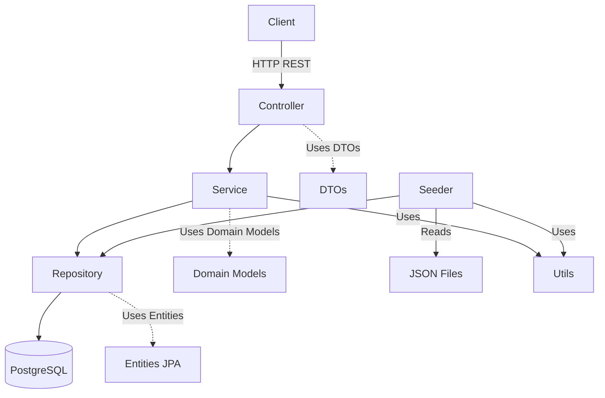

# Arquitetura do Sistema — Pokédex BFF

## 1. Visão Geral

O **Pokédex BFF** é um backend que fornece dados estruturados de Pokémon através de APIs REST.
A arquitetura é baseada em **Spring Boot**, organizada em camadas bem definidas para facilitar manutenção, testes e evolução.

---

## 2. Objetivos Arquiteturais

* Separação clara entre apresentação, domínio e infraestrutura.
* Facilidade para testes unitários e integração.
* Evolução e manutenção simplificadas.
* Substituição de tecnologias sem impacto na lógica de negócio.
* Pré-carga de dados via JSON para banco relacional.

---

## 3. Visão Geral da Arquitetura

### Camadas

| Camada               | Responsabilidade                                                    | Pacote Base         |
| -------------------- | ------------------------------------------------------------------- | ------------------- |
| **Controller**       | Interface HTTP REST, recebe e retorna dados JSON                    | `controller/`       |
| **DTO**              | Objetos de troca de dados via API, desacoplados de persistência     | `controller/dtos/`  |
| **Service**          | Orquestra lógica de aplicação, regras de negócio e fluxos           | `service/`          |
| **Domain Model**     | Modelos de negócio puros, regras e validações de domínio (opcional) | `domain/model/`     |
| **Infra Entity**     | Entidades JPA para mapeamento relacional                            | `infra/entity/`     |
| **Infra Repository** | Repositórios Spring Data JPA para acesso ao banco                   | `infra/repository/` |
| **Seeder**           | Carregamento inicial de dados (JSON → banco)                        | `infra/seeder/`     |
| **Utils**            | Utilitários e helpers genéricos, reutilizáveis em todas as camadas  | `utils/`            |

---

## 4. Fluxo Principal

1. **Cliente** faz requisição HTTP REST para o Controller.
2. **Controller** recebe os parâmetros e delega para o Service.
3. **Service** executa a lógica de negócio e consulta os Repositórios.
4. **Repositórios** acessam o banco de dados via JPA.
5. **Dados** são convertidos entre Entidades, Modelos de Domínio e DTOs via mappers.
6. **Service** retorna DTOs para o Controller, que devolve a resposta HTTP.

---

## 5. Tecnologias Utilizadas

* **Spring Boot:** Framework principal para APIs REST e injeção de dependências.
* **Spring Data JPA:** Repositórios e queries para banco relacional.
* **PostgreSQL:** Banco de dados relacional robusto.
* **Jackson:** Serialização/deserialização de JSON.
* **SLF4J + Logback:** Logging estruturado.
* **Kotlin:** Linguagem principal do projeto.

---

## 6. Padrões e Boas Práticas

* **Separação de responsabilidades:** Cada camada com função única.
* **DTOs isolados das entidades:** Evita vazamento de detalhes internos.
* **Transações controladas via `@Transactional`.**
* **Logging informativo e rastreável.**
* **Seeder desacoplado para importar dados de arquivos JSON.**
* **Transformações claras com funções utilitárias ou `extension functions`.**

---

## 7. Detalhes Técnicos

### 7.1 Controller

* Local: `controller/`
* Recebe parâmetros de paginação, filtros e comandos de rota.
* Retorna DTOs encapsulados em `ResponseEntity`.

### 7.2 Service

* Local: `service/`
* Implementa lógica de orquestração, paginação, filtros.
* Transações são gerenciadas nesta camada.

### 7.3 Domain Model

* Local: `domain/model/`
* Classes simples, sem dependências externas.

### 7.4 Infra Entity

* Local: `infra/entity/`
* Classes JPA com anotações `@Entity` e `@Table`.

### 7.5 Infra Repository

* Local: `infra/repository/`
* Interfaces estendendo `JpaRepository`.
* Queries personalizadas via `@Query`.

### 7.6 Seeder

* Local: `infra/seeder/`
* Executado na inicialização (`CommandLineRunner`).
* Lê JSONs, popula banco e faz logs de progresso.

### 7.7 Utils

* Local: `utils/`
* Funções auxiliares e helpers genéricos.
* Usados por qualquer camada.

---

## 8. Estrutura de Pastas

```plaintext
com.pokedex.bff
├── controller
│   └── PokemonController.kt
├── controller/dtos
│   └── PokemonListResponse.kt
├── service
│   └── PokemonService.kt
├── domain/model
│   └── Pokemon.kt
├── infra/entity
│   └── PokemonEntity.kt
├── infra/repository
│   └── PokemonRepository.kt
├── infra/seeder
│   └── DatabaseSeeder.kt
├── utils
│   └── JsonFile.kt
```

---

## 9. Diagrama de Componentes



---

## 10. Diagrama de Sequência


---