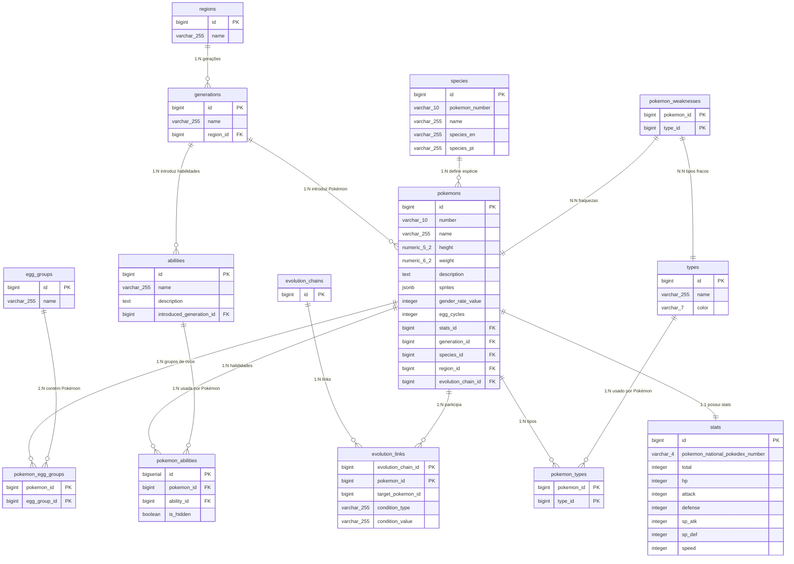

Compreendo que você está com dificuldades para copiar o conteúdo do Canvas. Vou fornecer o mesmo conteúdo em Markdown aqui no chat, para que você possa copiá-lo facilmente:

```markdown
# Documentação do Esquema do Banco de Dados Pokémon

Este documento descreve o esquema de banco de dados relacional para armazenar informações sobre Pokémon, suas características, evoluções, tipos, habilidades, regiões e grupos de ovos. O banco de dados de destino é PostgreSQL.

## Visão Geral do Esquema

O esquema é composto por **14 tabelas** principais e de junção, projetadas para manter os dados normalizados, minimizando redundância e garantindo a integridade referencial. As tabelas se relacionam para permitir consultas complexas e eficientes sobre o universo Pokémon.

As 14 tabelas são:

* `regions`

* `types`

* `egg_groups`

* `species`

* `generations`

* `abilities`

* `pokemons`

* `stats`

* `pokemon_types`

* `pokemon_abilities`

* `pokemon_egg_groups`

* `evolution_chains`

* `evolution_links`

* `pokemon_weaknesses`

## Entidades (Tabelas) e Seus Relacionamentos

### 1. `regions`

Armazena informações sobre as diferentes regiões do mundo Pokémon.

* **Finalidade:** Categorizar gerações.

* **Colunas:**

    * `id` (BIGINT PRIMARY KEY): Identificador único da região.

    * `name` (VARCHAR(255) NOT NULL UNIQUE): Nome da região (ex: 'Kanto', 'Johto').

* **Relacionamentos:**

    * `generations`: Uma região é referenciada por uma ou mais gerações (`generations.region_id`).

### 2. `types`

Armazena informações sobre os tipos elementais dos Pokémon.

* **Finalidade:** Definir os tipos dos Pokémon e suas fraquezas/resistências.

* **Colunas:**

    * `id` (BIGINT PRIMARY KEY): Identificador único do tipo.

    * `name` (VARCHAR(255) NOT NULL UNIQUE): Nome do tipo (ex: 'Fogo', 'Água').

    * `color` (VARCHAR(7)): Código de cor hexadecimal associado ao tipo (ex: '#EE8130').

* **Relacionamentos:**

    * `pokemon_types`: Um tipo pode ser associado a vários Pokémon.

    * `pokemon_weaknesses`: Um tipo pode ser uma fraqueza para vários Pokémon.

### 3. `egg_groups`

Armazena informações sobre os grupos de ovos aos quais os Pokémon pertencem para fins de reprodução.

* **Finalidade:** Agrupar Pokémon com características reprodutivas compatíveis.

* **Colunas:**

    * `id` (BIGINT PRIMARY KEY): Identificador único do grupo de ovos.

    * `name` (VARCHAR(255) NOT NULL UNIQUE): Nome do grupo de ovos (ex: 'Amorfo', 'Dragão').

* **Relacionamentos:**

    * `pokemon_egg_groups`: Um grupo de ovos pode ser associado a vários Pokémon.

### 4. `species`

Armazena informações sobre as espécies gerais de Pokémon, que podem ter várias formas ou evoluções.

* **Finalidade:** Categorizar Pokémon por sua espécie base e informações de Pokédex.

* **Colunas:**

    * `id` (BIGINT PRIMARY KEY): Identificador único da espécie.

    * `pokemon_number` (VARCHAR(10)): Número da Pokédex nacional da espécie (ex: '0001').

    * `name` (VARCHAR(255) NOT NULL): Nome da espécie (ex: 'Bulbasaur').

    * `species_en` (VARCHAR(255)): Descrição da espécie em inglês (ex: 'Seed Pokémon').

    * `species_pt` (VARCHAR(255)): Descrição da espécie em português (ex: 'Pokémon Semente').

* **Relacionamentos:**

    * `pokemons`: Uma espécie pode ser associada a vários Pokémon (e.g., formas diferentes do mesmo número da Pokédex).

### 5. `generations`

Armazena informações sobre as diferentes gerações de Pokémon.

* **Finalidade:** Agrupar Pokémon, habilidades e outras características por sua geração de introdução.

* **Colunas:**

    * `id` (BIGINT PRIMARY KEY): Identificador único da geração.

    * `name` (VARCHAR(255) NOT NULL UNIQUE): Nome da geração (ex: 'Geração I').

    * `region_id` (BIGINT NOT NULL): Chave estrangeira referenciando a tabela `regions`.

* **Relacionamentos:**

    * `regions`: Uma geração pertence a uma região.

    * `pokemons`: Uma geração introduz vários Pokémon.

    * `abilities`: Uma geração introduz várias habilidades.

### 6. `abilities`

Armazena informações sobre as habilidades especiais dos Pokémon.

* **Finalidade:** Detalhar as habilidades que os Pokémon podem possuir.

* **Colunas:**

    * `id` (BIGINT PRIMARY KEY): Identificador único da habilidade.

    * `name` (VARCHAR(255) NOT NULL UNIQUE): Nome da habilidade.

    * `description` (TEXT): Descrição detalhada da habilidade.

    * `introduced_generation_id` (BIGINT): Chave estrangeira referenciando a tabela `generations`, indicando em qual geração a habilidade foi introduzida.

* **Relacionamentos:**

    * `generations`: Uma habilidade é introduzida em uma geração.

    * `pokemon_abilities`: Uma habilidade pode ser possuída por vários Pokémon.

### 7. `pokemons`

Armazena as informações principais de cada Pokémon individual (incluindo suas formas).

* **Finalidade:** Entidade central para todas as informações detalhadas sobre os Pokémon.

* **Colunas:**

    * `id` (BIGINT PRIMARY KEY): Identificador único do Pokémon (incluindo formas alternativas).

    * `number` (VARCHAR(10) NOT NULL UNIQUE): Número da Pokédex nacional (identificador principal para muitos relacionamentos).

    * `name` (VARCHAR(255) NOT NULL): Nome do Pokémon (ex: 'Bulbasaur', 'Charizard Mega Charizard Y').

    * `stats_id` (BIGINT UNIQUE): Chave estrangeira referenciando a tabela `stats` (relacionamento 1:1).

    * `generation_id` (BIGINT NOT NULL): Chave estrangeira referenciando a tabela `generations`.

    * `species_id` (BIGINT NOT NULL): Chave estrangeira referenciando a tabela `species`.

    * `region_id` (BIGINT): Chave estrangeira referenciando a tabela `regions`.

    * `evolution_chain_id` (BIGINT): Chave estrangeira referenciando a tabela `evolution_chains`.

    * `height` (NUMERIC(5, 2)): Altura do Pokémon em metros.

    * `weight` (NUMERIC(6, 2)): Peso do Pokémon em quilogramas.

    * `description` (TEXT): Descrição de Pokédex do Pokémon.

    * `sprites` (JSONB): Objeto JSON que armazena URLs para diferentes sprites do Pokémon.

    * `gender_rate_value` (INT): Taxa de gênero (informações sobre proporção de gênero).

    * `egg_cycles` (INT): Número de ciclos de ovos para chocar.

* **Relacionamentos:**

    * `stats`: Um Pokémon possui um conjunto de atributos.

    * `generations`: Um Pokémon pertence a uma geração.

    * `species`: Um Pokémon é de uma determinada espécie.

    * `regions`: Um Pokémon pode ser associado a uma região específica.

    * `evolution_chains`: Um Pokémon está associado a uma cadeia de evolução.

    * `pokemon_types`: Um Pokémon pode ter um ou dois tipos.

    * `pokemon_abilities`: Um Pokémon pode ter uma ou mais habilidades.

    * `pokemon_egg_groups`: Um Pokémon pode pertencer a um ou mais grupos de ovos.

    * `evolution_links`: Um Pokémon pode ser a origem ou o alvo de um link de evolução.

    * `pokemon_weaknesses`: Um Pokémon possui fraquezas a certos tipos.

### 8. `stats`

Armazena os atributos de batalha (HP, Attack, Defense, etc.) de cada Pokémon.

* **Finalidade:** Fornecer os valores dos atributos para cada forma de Pokémon.

* **Colunas:**

    * `id` (BIGINT PRIMARY KEY): Identificador único do conjunto de atributos.

    * `total` (INT): Soma total dos atributos.

    * `hp` (INT): Pontos de vida.

    * `attack` (INT): Atributo de ataque físico.

    * `defense` (INT): Atributo de defesa física.

    * `sp_atk` (INT): Atributo de ataque especial.

    * `sp_def` (INT): Atributo de defesa especial.

    * `speed` (INT): Atributo de velocidade.

* **Relacionamentos:**

    * `pokemons`: Um conjunto de atributos pertence a um Pokémon (`pokemons.stats_id` referencia `stats.id`).

### 9. `pokemon_types`

Tabela de junção para o relacionamento N:N entre `pokemons` e `types`.

* **Finalidade:** Registrar quais tipos um Pokémon possui.

* **Colunas:**

    * `pokemon_id` (BIGINT NOT NULL): Chave estrangeira referenciando `pokemons.id`.

    * `type_id` (BIGINT NOT NULL): Chave estrangeira referenciando `types.id`.

    * `PRIMARY KEY (pokemon_id, type_id)`: Chave primária composta.

* **Relacionamentos:**

    * `pokemons`: Um Pokémon pode ter vários tipos.

    * `types`: Um tipo pode ser atribuído a vários Pokémon.

### 10. `pokemon_abilities`

Tabela de junção para o relacionamento N:N entre `pokemons` e `abilities` com uma coluna extra.

* **Finalidade:** Registrar quais habilidades um Pokémon pode ter e se são ocultas.

* **Colunas:**

    * `id` (BIGSERIAL PRIMARY KEY): Identificador único para a associação.

    * `pokemon_id` (BIGINT NOT NULL): Chave estrangeira referenciando `pokemons.id`.

    * `ability_id` (BIGINT NOT NULL): Chave estrangeira referenciando `abilities.id`.

    * `is_hidden` (BOOLEAN NOT NULL): Indica se a habilidade é uma habilidade oculta.

* **Relacionamentos:**

    * `pokemons`: Um Pokémon pode ter várias habilidades.

    * `abilities`: Uma habilidade pode ser possuída por vários Pokémon.

### 11. `pokemon_egg_groups`

Tabela de junção para o relacionamento N:N entre `pokemons` e `egg_groups`.

* **Finalidade:** Registrar a quais grupos de ovos um Pokémon pertence.

* **Colunas:**

    * `pokemon_id` (BIGINT NOT NULL): Chave estrangeira referenciando `pokemons.id`.

    * `egg_group_id` (BIGINT NOT NULL): Chave estrangeira referenciando `egg_groups.id`.

    * `PRIMARY KEY (pokemon_id, egg_group_id)`: Chave primária composta.

* **Relacionamentos:**

    * `pokemons`: Um Pokémon pode pertencer a vários grupos de ovos.

    * `egg_groups`: Um grupo de ovos pode conter vários Pokémon.

### 12. `evolution_chains`

Armazena a identificação de uma cadeia de evolução.

* **Finalidade:** Agrupar os passos de evolução que fazem parte de uma mesma linha evolutiva.

* **Colunas:**

    * `id` (BIGINT PRIMARY KEY): Identificador único da cadeia de evolução.

* **Relacionamentos:**

    * `evolution_links`: Uma cadeia de evolução é composta por vários links de evolução.

    * `pokemons`: Um Pokémon está associado a uma cadeia de evolução.

### 13. `evolution_links`

Armazena os links individuais dentro de uma cadeia de evolução.

* **Finalidade:** Detalhar como um Pokémon evolui para outro dentro de uma cadeia.

* **Colunas:**

    * `evolution_chain_id` (BIGINT NOT NULL): Chave estrangeira referenciando `evolution_chains.id`.

    * `pokemon_id` (BIGINT NOT NULL): Chave estrangeira referenciando `pokemons.id` (o Pokémon que evolui).

    * `target_pokemon_id` (BIGINT): Chave estrangeira referenciando `pokemons.id` (o Pokémon para o qual evolui). Pode ser NULL se for o último Pokémon na cadeia.

    * `condition_type` (VARCHAR(255)): Tipo de condição para a evolução (ex: 'level_up', 'trade', 'item_use').

    * `condition_value` (VARCHAR(255)): Valor da condição (ex: '16' para level_up, nome do item).

    * `PRIMARY KEY (evolution_chain_id, pokemon_id)`: Chave primária composta para identificar um link único na cadeia.

* **Relacionamentos:**

    * `evolution_chains`: Um link de evolução pertence a uma cadeia.

    * `pokemons`: Referencia o Pokémon que evolui e o Pokémon resultante da evolução.

### 14. `pokemon_weaknesses`

Tabela de junção para o relacionamento N:N entre `pokemons` e `types`, especificando as fraquezas.

* **Finalidade:** Registrar quais tipos um Pokémon é fraco contra.

* **Colunas:**

    * `pokemon_id` (BIGINT NOT NULL): Chave estrangeira referenciando `pokemons.id`.

    * `type_id` (BIGINT NOT NULL): Chave estrangeira referenciando `types.id` (o tipo que é uma fraqueza).

    * `PRIMARY KEY (pokemon_id, type_id)`: Chave primária composta.

* **Relacionamentos:**

    * `pokemons`: Um Pokémon pode ter várias fraquezas.

    * `types`: Um tipo pode ser uma fraqueza para vários Pokémon.

