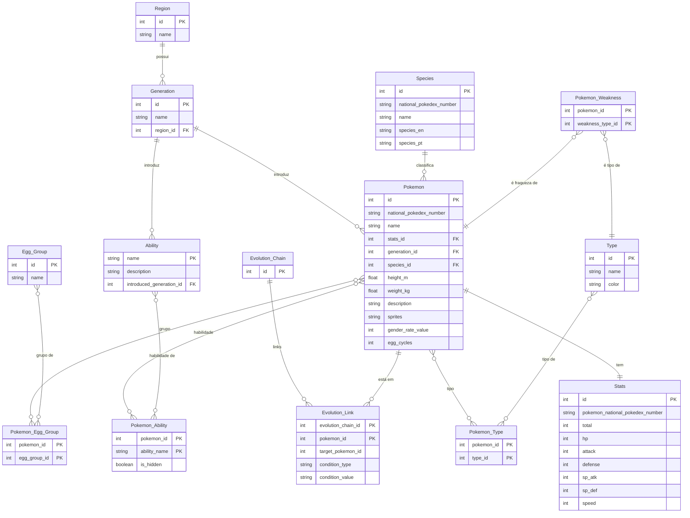

# Documentação do Esquema do Banco de Dados Pokémon

Este documento descreve o esquema de banco de dados relacional para armazenar informações sobre Pokémon, suas características, evoluções, tipos, habilidades, regiões e grupos de ovos. O banco de dados de destino é PostgreSQL.

---

## Visão Geral do Esquema

O esquema é composto por **15 tabelas** principais e de junção, projetadas para manter os dados normalizados, minimizando redundância e garantindo a integridade referencial. As tabelas se relacionam para permitir consultas complexas e eficientes sobre o universo Pokémon.

---

## Entidades (Tabelas) e Seus Relacionamentos

### 1. `Region`

Armazena informações sobre as diferentes regiões do mundo Pokémon.

* **Finalidade:** Categorizar gerações.
* **Colunas:**
    * `id` (INT PRIMARY KEY): Identificador único da região.
    * `name` (VARCHAR(255) NOT NULL UNIQUE): Nome da região (ex: 'Kanto', 'Johto').
* **Relacionamentos:**
    * `Generation`: Uma região é referenciada por uma ou mais gerações (`Generation.region_id`).

### 2. `Type`

Armazena informações sobre os tipos elementais dos Pokémon.

* **Finalidade:** Definir os tipos dos Pokémon e suas fraquezas/resistências.
* **Colunas:**
    * `id` (INT PRIMARY KEY): Identificador único do tipo.
    * `name` (VARCHAR(255) NOT NULL UNIQUE): Nome do tipo (ex: 'Fogo', 'Água').
    * `color` (VARCHAR(7)): Código de cor hexadecimal associado ao tipo (ex: '#EE8130').
* **Relacionamentos:**
    * `Pokemon_Type`: Um tipo pode ser associado a vários Pokémon.
    * `Pokemon_Weakness`: Um tipo pode ser uma fraqueza para vários Pokémon.

### 3. `Egg_Group`

Armazena informações sobre os grupos de ovos aos quais os Pokémon pertencem para fins de reprodução.

* **Finalidade:** Agrupar Pokémon com características reprodutivas compatíveis.
* **Colunas:**
    * `id` (INT PRIMARY KEY): Identificador único do grupo de ovos.
    * `name` (VARCHAR(255) NOT NULL UNIQUE): Nome do grupo de ovos (ex: 'Amorfo', 'Dragão').
* **Relacionamentos:**
    * `Pokemon_Egg_Group`: Um grupo de ovos pode ser associado a vários Pokémon.

### 4. `Species`

Armazena informações sobre as espécies gerais de Pokémon, que podem ter várias formas ou evoluções.

* **Finalidade:** Categorizar Pokémon por sua espécie base e informações de Pokédex.
* **Colunas:**
    * `id` (INT PRIMARY KEY): Identificador único da espécie.
    * `national_pokedex_number` (VARCHAR(4) NOT NULL UNIQUE): Número da Pokédex nacional da espécie (ex: '0001').
    * `name` (VARCHAR(255) NOT NULL): Nome da espécie (ex: 'Bulbasaur').
    * `species_en` (VARCHAR(255)): Descrição da espécie em inglês (ex: 'Seed Pokémon').
    * `species_pt` (VARCHAR(255)): Descrição da espécie em português (ex: 'Pokémon Semente').
* **Relacionamentos:**
    * `Pokemon`: Uma espécie pode ser associada a vários Pokémon (e.g., formas diferentes do mesmo número da Pokédex).

### 5. `Generation`

Armazena informações sobre as diferentes gerações de Pokémon.

* **Finalidade:** Agrupar Pokémon, habilidades e outras características por sua geração de introdução.
* **Colunas:**
    * `id` (INT PRIMARY KEY): Identificador único da geração.
    * `name` (VARCHAR(255) NOT NULL UNIQUE): Nome da geração (ex: 'Geração I').
    * `region_id` (INT NOT NULL): Chave estrangeira referenciando a tabela `Region`.
* **Relacionamentos:**
    * `Region`: Uma geração pertence a uma região.
    * `Pokemon`: Uma geração introduz vários Pokémon.
    * `Ability`: Uma geração introduz várias habilidades.

### 6. `Ability`

Armazena informações sobre as habilidades especiais dos Pokémon.

* **Finalidade:** Detalhar as habilidades que os Pokémon podem possuir.
* **Colunas:**
    * `name` (VARCHAR(255) PRIMARY KEY): Nome da habilidade (usado como chave primária, pois é único).
    * `description` (TEXT): Descrição detalhada da habilidade.
    * `introduced_generation_id` (INT): Chave estrangeira referenciando a tabela `Generation`, indicando em qual geração a habilidade foi introduzida.
* **Relacionamentos:**
    * `Generation`: Uma habilidade é introduzida em uma geração.
    * `Pokemon_Ability`: Uma habilidade pode ser possuída por vários Pokémon.

### 7. `Pokemon`

Armazena as informações principais de cada Pokémon individual (incluindo suas formas).

* **Finalidade:** Entidade central para todas as informações detalhadas sobre os Pokémon.
* **Colunas:**
    * `id` (INT PRIMARY KEY): Identificador único do Pokémon (incluindo formas alternativas).
    * `national_pokedex_number` (VARCHAR(4) NOT NULL UNIQUE): Número da Pokédex nacional (identificador principal para muitos relacionamentos).
    * `name` (VARCHAR(255) NOT NULL): Nome do Pokémon (ex: 'Bulbasaur', 'Charizard Mega Charizard Y').
    * `stats_id` (INT): Chave estrangeira referenciando a tabela `Stats` (relacionamento 1:1).
    * `generation_id` (INT NOT NULL): Chave estrangeira referenciando a tabela `Generation`.
    * `species_id` (INT NOT NULL): Chave estrangeira referenciando a tabela `Species`.
    * `height_m` (NUMERIC(4, 2)): Altura do Pokémon em metros.
    * `weight_kg` (NUMERIC(6, 2)): Peso do Pokémon em quilogramas.
    * `description` (TEXT): Descrição de Pokédex do Pokémon.
    * `sprites` (JSONB): Objeto JSON que armazena URLs para diferentes sprites do Pokémon.
    * `gender_rate_value` (INT): Taxa de gênero (informações sobre proporção de gênero).
    * `egg_cycles` (INT): Número de ciclos de ovos para chocar.
* **Relacionamentos:**
    * `Stats`: Um Pokémon possui um conjunto de atributos.
    * `Generation`: Um Pokémon pertence a uma geração.
    * `Species`: Um Pokémon é de uma determinada espécie.
    * `Pokemon_Type`: Um Pokémon pode ter um ou dois tipos.
    * `Pokemon_Ability`: Um Pokémon pode ter uma ou mais habilidades.
    * `Pokemon_Egg_Group`: Um Pokémon pode pertencer a um ou mais grupos de ovos.
    * `Evolution_Link`: Um Pokémon pode fazer parte de uma cadeia de evolução.
    * `Pokemon_Weakness`: Um Pokémon possui fraquezas a certos tipos.

### 8. `Stats`

Armazena os atributos de batalha (HP, Attack, Defense, etc.) de cada Pokémon.

* **Finalidade:** Fornecer os valores dos atributos para cada forma de Pokémon.
* **Colunas:**
    * `id` (INT PRIMARY KEY): Identificador único do conjunto de atributos.
    * `pokemon_national_pokedex_number` (VARCHAR(4) NOT NULL UNIQUE): Chave estrangeira referenciando o `national_pokedex_number` da tabela `Pokemon`, garantindo uma relação 1:1.
    * `total` (INT): Soma total dos atributos.
    * `hp` (INT): Pontos de vida.
    * `attack` (INT): Atributo de ataque físico.
    * `defense` (INT): Atributo de defesa física.
    * `sp_atk` (INT): Atributo de ataque especial.
    * `sp_def` (INT): Atributo de defesa especial.
    * `speed` (INT): Atributo de velocidade.
* **Relacionamentos:**
    * `Pokemon`: Um conjunto de atributos pertence a um Pokémon.

### 9. `Pokemon_Type`

Tabela de junção para o relacionamento N:N entre `Pokemon` e `Type`.

* **Finalidade:** Registrar quais tipos um Pokémon possui.
* **Colunas:**
    * `pokemon_id` (INT NOT NULL): Chave estrangeira referenciando `Pokemon.id`.
    * `type_id` (INT NOT NULL): Chave estrangeira referenciando `Type.id`.
    * `PRIMARY KEY (pokemon_id, type_id)`: Chave primária composta.
* **Relacionamentos:**
    * `Pokemon`: Um Pokémon pode ter vários tipos.
    * `Type`: Um tipo pode ser atribuído a vários Pokémon.

### 10. `Pokemon_Ability`

Tabela de junção para o relacionamento N:N entre `Pokemon` e `Ability`.

* **Finalidade:** Registrar quais habilidades um Pokémon pode ter.
* **Colunas:**
    * `pokemon_id` (INT NOT NULL): Chave estrangeira referenciando `Pokemon.id`.
    * `ability_name` (VARCHAR(255) NOT NULL): Chave estrangeira referenciando `Ability.name`.
    * `is_hidden` (BOOLEAN): Indica se a habilidade é uma habilidade oculta.
    * `PRIMARY KEY (pokemon_id, ability_name)`: Chave primária composta.
* **Relacionamentos:**
    * `Pokemon`: Um Pokémon pode ter várias habilidades.
    * `Ability`: Uma habilidade pode ser possuída por vários Pokémon.

### 11. `Pokemon_Egg_Group`

Tabela de junção para o relacionamento N:N entre `Pokemon` e `Egg_Group`.

* **Finalidade:** Registrar a quais grupos de ovos um Pokémon pertence.
* **Colunas:**
    * `pokemon_id` (INT NOT NULL): Chave estrangeira referenciando `Pokemon.id`.
    * `egg_group_id` (INT NOT NULL): Chave estrangeira referenciando `Egg_Group.id`.
    * `PRIMARY KEY (pokemon_id, egg_group_id)`: Chave primária composta.
* **Relacionamentos:**
    * `Pokemon`: Um Pokémon pode pertencer a vários grupos de ovos.
    * `Egg_Group`: Um grupo de ovos pode conter vários Pokémon.

### 12. `Evolution_Chain`

Armazena a identificação de uma cadeia de evolução.

* **Finalidade:** Agrupar os passos de evolução que fazem parte de uma mesma linha evolutiva.
* **Colunas:**
    * `id` (INT PRIMARY KEY): Identificador único da cadeia de evolução.
* **Relacionamentos:**
    * `Evolution_Link`: Uma cadeia de evolução é composta por vários links de evolução.

### 13. `Evolution_Link`

Armazena os links individuais dentro de uma cadeia de evolução.

* **Finalidade:** Detalhar como um Pokémon evolui para outro dentro de uma cadeia.
* **Colunas:**
    * `evolution_chain_id` (INT NOT NULL): Chave estrangeira referenciando `Evolution_Chain.id`.
    * `pokemon_id` (INT NOT NULL): Chave estrangeira referenciando `Pokemon.id` (o Pokémon que evolui).
    * `target_pokemon_id` (INT): Chave estrangeira referenciando `Pokemon.id` (o Pokémon para o qual evolui). Pode ser NULL se for o último Pokémon na cadeia.
    * `condition_type` (VARCHAR(255)): Tipo de condição para a evolução (ex: 'level_up', 'trade', 'item_use').
    * `condition_value` (VARCHAR(255)): Valor da condição (ex: '16' para level_up, nome do item).
    * `PRIMARY KEY (evolution_chain_id, pokemon_id)`: Chave primária composta para identificar um link único na cadeia.
* **Relacionamentos:**
    * `Evolution_Chain`: Um link de evolução pertence a uma cadeia.
    * `Pokemon`: Referencia o Pokémon que evolui e o Pokémon resultante da evolução.

### 14. `Pokemon_Weakness`

Tabela de junção para o relacionamento N:N entre `Pokemon` e `Type`, especificando as fraquezas.

* **Finalidade:** Registrar quais tipos um Pokémon é fraco contra.
* **Colunas:**
    * `pokemon_id` (INT NOT NULL): Chave estrangeira referenciando `Pokemon.id`.
    * `weakness_type_id` (INT NOT NULL): Chave estrangeira referenciando `Type.id` (o tipo que é uma fraqueza).
    * `PRIMARY KEY (pokemon_id, weakness_type_id)`: Chave primária composta.
* **Relacionamentos:**
    * `Pokemon`: Um Pokémon pode ter várias fraquezas.
    * `Type`: Um tipo pode ser uma fraqueza para vários Pokémon.

---

