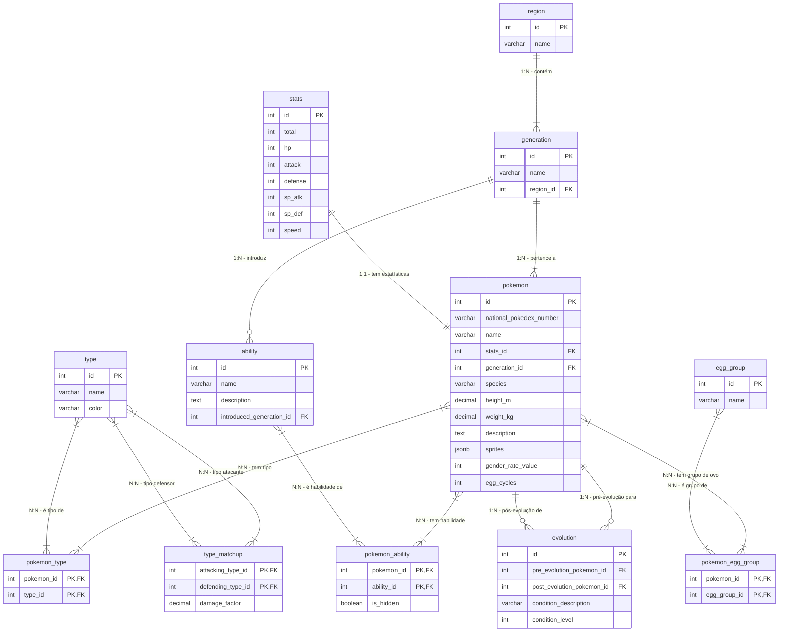

# Documentação do Esquema do Banco de Dados Pokémon

Este documento descreve o esquema de banco de dados relacional para armazenar informações sobre Pokémon, suas características, evoluções, tipos, habilidades, regiões e grupos de ovos.

## Visão Geral do Esquema

O esquema é composto por 14 tabelas, projetadas para manter os dados normalizados, minimizando redundância e garantindo a integridade referencial. As tabelas se relacionam para permitir consultas complexas e eficientes sobre o universo Pokémon.

---

## Entidades (Tabelas) e Seus Relacionamentos

### 1. `region`

Armazena informações sobre as diferentes regiões do mundo Pokémon.

* **Finalidade:** Categorizar gerações e outras entidades que possam ser específicas de uma região.
* **Colunas:**
    * `id` (SERIAL PRIMARY KEY): Identificador único da região. Gerado automaticamente.
    * `name` (VARCHAR(255) NOT NULL UNIQUE): Nome da região (ex: 'Kanto', 'Johto').
* **Relacionamentos:**
    * `generation`: Uma região pode ter múltiplas gerações (`generation.region_id`).

### 2. `generation`

Armazena informações sobre as diferentes gerações de Pokémon.

* **Finalidade:** Agrupar Pokémon, habilidades e outras características por sua geração de introdução.
* **Colunas:**
    * `id` (SERIAL PRIMARY KEY): Identificador único da geração. Gerado automaticamente.
    * `name` (VARCHAR(50) NOT NULL UNIQUE): Nome da geração (ex: 'Generation 1').
    * `region_id` (INTEGER NOT NULL REFERENCES `region(id)`): Chave estrangeira para a região principal à qual esta geração pertence.
* **Relacionamentos:**
    * `region`: Uma geração pertence a uma única região (`generation.region_id`).
    * `pokemon`: Uma geração introduz múltiplos Pokémon (`pokemon.generation_id`).
    * `ability`: Uma geração introduz múltiplas habilidades (`ability.introduced_generation_id`).

### 3. `type`

Armazena os diferentes tipos elementais de Pokémon.

* **Finalidade:** Classificar Pokémon por seus tipos e definir as relações de efetividade entre eles.
* **Colunas:**
    * `id` (SERIAL PRIMARY KEY): Identificador único do tipo. Gerado automaticamente.
    * `name` (VARCHAR(255) NOT NULL UNIQUE): Nome do tipo (ex: 'Grass', 'Fire', 'Water').
    * `color` (VARCHAR(50) NOT NULL): Cor associada ao tipo para fins de interface.
* **Relacionamentos:**
    * `pokemon_type`: Um tipo pode ser associado a múltiplos Pokémon (`pokemon_type.type_id`).
    * `type_matchup`: Um tipo pode atuar como tipo atacante ou defensor em matchups de dano (`type_matchup.attacking_type_id`, `type_matchup.defending_type_id`).

### 4. `stats`

Armazena os valores base de estatísticas para um Pokémon.

* **Finalidade:** Manter as estatísticas (HP, Attack, Defense, etc.) de forma separada e referenciável.
* **Colunas:**
    * `id` (SERIAL PRIMARY KEY): Identificador único do conjunto de estatísticas. Gerado automaticamente.
    * `total` (INTEGER): Soma de todas as estatísticas.
    * `hp` (INTEGER): Pontos de vida.
    * `attack` (INTEGER): Estatística de Ataque.
    * `defense` (INTEGER): Estatística de Defesa.
    * `sp_atk` (INTEGER): Estatística de Ataque Especial.
    * `sp_def` (INTEGER): Estatística de Defesa Especial.
    * `speed` (INTEGER): Estatística de Velocidade.
* **Relacionamentos:**
    * `pokemon`: Um conjunto de estatísticas pertence a um único Pokémon (`pokemon.stats_id`). É uma relação 1-para-1, garantida por `UNIQUE` na chave estrangeira.

### 5. `pokemon`

A entidade central, que armazena as informações principais de cada Pokémon.

* **Finalidade:** Armazenar dados fundamentais sobre cada criatura.
* **Colunas:**
    * `id` (SERIAL PRIMARY KEY): Identificador interno único do Pokémon. Gerado automaticamente. Usado para chaves estrangeiras.
    * `national_pokedex_number` (VARCHAR(10) NOT NULL UNIQUE): O número oficial da Pokédex Nacional (ex: '0001' para Bulbasaur). É um identificador externo único.
    * `name` (VARCHAR(255) NOT NULL): Nome do Pokémon.
    * `stats_id` (INTEGER UNIQUE REFERENCES `stats(id)`): Chave estrangeira para o conjunto de estatísticas do Pokémon. A restrição `UNIQUE` garante a relação 1-para-1.
    * `generation_id` (INTEGER NOT NULL REFERENCES `generation(id)`): Chave estrangeira para a geração em que o Pokémon foi introduzido.
    * `species` (VARCHAR(255)): A descrição da espécie do Pokémon (ex: 'Seed Pokémon').
    * `height_m` (DECIMAL(5, 2)): Altura do Pokémon em metros.
    * `weight_kg` (DECIMAL(6, 2)): Peso do Pokémon em quilogramas.
    * `description` (TEXT): Uma descrição textual abrangente do Pokémon.
    * `sprites` (JSONB): **Detalhes importantes abaixo.**
    * `gender_rate_value` (INTEGER): Valor que indica a taxa de gênero (ex: 1 para 12.5% female, 0 para 100% male, 8 para 100% female. NULL ou um valor específico (como -1) pode indicar sem gênero).
    * `egg_cycles` (INTEGER): Número de ciclos de ovo necessários para chocar o Pokémon.
* **Relacionamentos:**
    * `stats`: Cada Pokémon tem um único conjunto de estatísticas (`pokemon.stats_id`).
    * `generation`: Cada Pokémon pertence a uma única geração (`pokemon.generation_id`).
    * `pokemon_type`: Um Pokémon pode ter um ou dois tipos (`pokemon_type.pokemon_id`). (Relação muitos-para-muitos via tabela de junção)
    * `pokemon_ability`: Um Pokémon pode ter múltiplas habilidades (`pokemon_ability.pokemon_id`). (Relação muitos-para-muitos via tabela de junção)
    * `pokemon_egg_group`: Um Pokémon pode pertencer a um ou mais grupos de ovos (`pokemon_egg_group.pokemon_id`). (Relação muitos-para-muitos via tabela de junção)
    * `evolution`: Um Pokémon pode ser uma pré-evolução ou pós-evolução em cadeias de evolução (`evolution.pre_evolution_pokemon_id`, `evolution.post_evolution_pokemon_id`).

### 6. `pokemon_type`

Tabela de junção para a relação muitos-para-muitos entre Pokémon e Tipos.

* **Finalidade:** Registrar quais tipos cada Pokémon possui.
* **Colunas:**
    * `pokemon_id` (INTEGER REFERENCES `pokemon(id)`): Chave estrangeira para o Pokémon.
    * `type_id` (INTEGER REFERENCES `type(id)`): Chave estrangeira para o Tipo.
    * `PRIMARY KEY (pokemon_id, type_id)`: Chave primária composta garantindo que um Pokémon não tenha o mesmo tipo duplicado.
* **Relacionamentos:**
    * `pokemon`: Relaciona-se com `pokemon`.
    * `type`: Relaciona-se com `type`.

### 7. `evolution`

Armazena as cadeias e condições de evolução entre Pokémon.

* **Finalidade:** Registrar como os Pokémon evoluem uns dos outros.
* **Colunas:**
    * `id` (SERIAL PRIMARY KEY): Identificador único da relação de evolução específica. Gerado automaticamente.
    * `pre_evolution_pokemon_id` (INTEGER NOT NULL REFERENCES `pokemon(id)`): Chave estrangeira para o Pokémon antes da evolução.
    * `post_evolution_pokemon_id` (INTEGER NOT NULL REFERENCES `pokemon(id)`): Chave estrangeira para o Pokémon após a evolução.
    * `condition_description` (VARCHAR(255) NOT NULL): Descrição da condição para a evolução (ex: 'Level Up', 'Trade', 'Use Item: Water Stone').
    * `condition_level` (INTEGER): O nível exigido para a evolução, se aplicável.
    * `UNIQUE (pre_evolution_pokemon_id, post_evolution_pokemon_id)`: Garante que uma evolução específica não seja duplicada.
* **Relacionamentos:**
    * `pokemon`: Referencia `pokemon` duas vezes (pré e pós-evolução).

### 8. `ability`

Armazena informações sobre as habilidades dos Pokémon.

* **Finalidade:** Registrar as habilidades que os Pokémon podem ter.
* **Colunas:**
    * `id` (SERIAL PRIMARY KEY): Identificador único da habilidade. Gerado automaticamente.
    * `name` (VARCHAR(255) NOT NULL UNIQUE): Nome da habilidade (ex: 'Overgrow', 'Blaze').
    * `description` (TEXT): Descrição detalhada da habilidade.
    * `introduced_generation_id` (INTEGER REFERENCES `generation(id)`): Chave estrangeira para a geração em que a habilidade foi introduzida.
* **Relacionamentos:**
    * `generation`: Uma habilidade é introduzida em uma geração (`ability.introduced_generation_id`).
    * `pokemon_ability`: Uma habilidade pode ser possuída por múltiplos Pokémon (`pokemon_ability.ability_id`).

### 9. `pokemon_ability`

Tabela de junção para a relação muitos-para-muitos entre Pokémon e Habilidades.

* **Finalidade:** Registrar quais habilidades cada Pokémon pode ter, incluindo se é uma habilidade oculta.
* **Colunas:**
    * `pokemon_id` (INTEGER REFERENCES `pokemon(id)`): Chave estrangeira para o Pokémon.
    * `ability_id` (INTEGER REFERENCES `ability(id)`): Chave estrangeira para a Habilidade.
    * `is_hidden` (BOOLEAN DEFAULT FALSE): Indica se a habilidade é uma habilidade oculta para aquele Pokémon.
    * `PRIMARY KEY (pokemon_id, ability_id)`: Chave primária composta.
* **Relacionamentos:**
    * `pokemon`: Relaciona-se com `pokemon`.
    * `ability`: Relaciona-se com `ability`.

### 10. `egg_group`

Armazena as categorias de grupos de ovos.

* **Finalidade:** Classificar Pokémon para fins de breeding.
* **Colunas:**
    * `id` (SERIAL PRIMARY KEY): Identificador único do grupo de ovos. Gerado automaticamente.
    * `name` (VARCHAR(50) NOT NULL UNIQUE): Nome do grupo de ovos (ex: 'Grass', 'Monster', 'Ditto').
* **Relacionamentos:**
    * `pokemon_egg_group`: Um grupo de ovos pode conter múltiplos Pokémon (`pokemon_egg_group.egg_group_id`).

### 11. `pokemon_egg_group`

Tabela de junção para a relação muitos-para-muitos entre Pokémon e Grupos de Ovos.

* **Finalidade:** Registrar a quais grupos de ovos cada Pokémon pertence.
* **Colunas:**
    * `pokemon_id` (INTEGER REFERENCES `pokemon(id)`): Chave estrangeira para o Pokémon.
    * `egg_group_id` (INTEGER REFERENCES `egg_group(id)`): Chave estrangeira para o Grupo de Ovos.
    * `PRIMARY KEY (pokemon_id, egg_group_id)`: Chave primária composta.
* **Relacionamentos:**
    * `pokemon`: Relaciona-se com `pokemon`.
    * `egg_group`: Relaciona-se com `egg_group`.

### 12. `type_matchup`

Armazena as relações de efetividade de dano entre tipos de Pokémon.

* **Finalidade:** Definir fraquezas, resistências e imunidades com base na interação de tipos.
* **Colunas:**
    * `attacking_type_id` (INTEGER NOT NULL REFERENCES `type(id)`): O ID do tipo que está causando o dano.
    * `defending_type_id` (INTEGER NOT NULL REFERENCES `type(id)`): O ID do tipo que está recebendo o dano.
    * `damage_factor` (DECIMAL(3,2) NOT NULL): O multiplicador de dano (ex: `2.0` para super efetivo, `0.5` para não muito efetivo, `0.0` para imune, `1.0` para dano normal).
    * `PRIMARY KEY (attacking_type_id, defending_type_id)`: Chave primária composta.
* **Relacionamentos:**
    * `type`: Referencia `type` duas vezes (tipo atacante e tipo defensor).

---

## Detalhes da Coluna `sprites` (JSONB)

A coluna `sprites` na tabela `pokemon` é do tipo **`JSONB`**.

* **Finalidade:** Armazenar uma coleção rica e semi-estruturada de URLs de imagens (sprites) para cada Pokémon.
* **Aonde encontrar:** https://pokeapi.co/api/v2/pokemon/1    
* **Estrutura do JSONB:** Conforme o exemplo fornecido:
    ```json
    {
      "back_default": "[https://raw.githubusercontent.com/PokeAPI/sprites/master/sprites/pokemon/back/1.png](https://raw.githubusercontent.com/PokeAPI/sprites/master/sprites/pokemon/back/1.png)",
      "back_female": null,
      "back_shiny": "[https://raw.githubusercontent.com/PokeAPI/sprites/master/sprites/pokemon/back/shiny/1.png](https://raw.githubusercontent.com/PokeAPI/sprites/master/sprites/pokemon/back/shiny/1.png)",
      "back_shiny_female": null,
      "front_default": "[https://raw.githubusercontent.com/PokeAPI/sprites/master/sprites/pokemon/1.png](https://raw.githubusercontent.com/PokeAPI/sprites/master/sprites/pokemon/1.png)",
      "front_female": null,
      "front_shiny": "[https://raw.githubusercontent.com/PokeAPI/sprites/master/sprites/pokemon/shiny/1.png](https://raw.githubusercontent.com/PokeAPI/sprites/master/sprites/pokemon/shiny/1.png)",
      "front_shiny_female": null,
      "other": {
        "dream_world": {
          "front_default": "[https://raw.githubusercontent.com/PokeAPI/sprites/master/sprites/pokemon/other/dream-world/1.svg](https://raw.githubusercontent.com/PokeAPI/sprites/master/sprites/pokemon/other/dream-world/1.svg)",
          "front_female": null
        },
        "home": {
          "front_default": "[https://raw.githubusercontent.com/PokeAPI/sprites/master/sprites/pokemon/other/home/1.png](https://raw.githubusercontent.com/PokeAPI/sprites/master/sprites/pokemon/other/home/1.png)",
          "front_female": null,
          "front_shiny": "[https://raw.githubusercontent.com/PokeAPI/sprites/master/sprites/pokemon/other/home/shiny/1.png](https://raw.githubusercontent.com/PokeAPI/sprites/master/sprites/pokemon/other/home/shiny/1.png)",
          "front_shiny_female": null
        },
        "official-artwork": {
          "front_default": "[https://raw.githubusercontent.com/PokeAPI/sprites/master/sprites/pokemon/other/official-artwork/1.png](https://raw.githubusercontent.com/PokeAPI/sprites/master/sprites/pokemon/other/official-artwork/1.png)",
          "front_shiny": "[https://raw.githubusercontent.com/PokeAPI/sprites/master/sprites/pokemon/other/official-artwork/shiny/1.png](https://raw.githubusercontent.com/PokeAPI/sprites/master/sprites/pokemon/other/official-artwork/shiny/1.png)"
        },
        "showdown": {
          "back_default": "[https://raw.githubusercontent.com/PokeAPI/sprites/master/sprites/pokemon/other/showdown/back/1.gif](https://raw.githubusercontent.com/PokeAPI/sprites/master/sprites/pokemon/other/showdown/back/1.gif)",
          "back_female": null,
          "back_shiny": "[https://raw.githubusercontent.com/PokeAPI/sprites/master/sprites/pokemon/other/showdown/back/shiny/1.gif](https://raw.githubusercontent.com/PokeAPI/sprites/master/sprites/pokemon/other/showdown/back/shiny/1.gif)",
          "back_shiny_female": null,
          "front_default": "[https://raw.githubusercontent.com/PokeAPI/sprites/master/sprites/pokemon/other/showdown/1.gif](https://raw.githubusercontent.com/PokeAPI/sprites/master/sprites/pokemon/other/showdown/1.gif)",
          "front_female": null,
          "front_shiny": "[https://raw.githubusercontent.com/PokeAPI/sprites/master/sprites/pokemon/other/showdown/shiny/1.gif](https://raw.githubusercontent.com/PokeAPI/sprites/master/sprites/pokemon/other/showdown/shiny/1.gif)",
          "front_shiny_female": null
        }
      }
    }
    ```
* **Relacionamento:** É uma relação **1-para-1** direta. Cada Pokémon (uma linha na tabela `pokemon`) possui exatamente um objeto `sprites` associado a ele. Este objeto contém todas as URLs de imagem para aquele Pokémon específico.
* **Vantagens do JSONB aqui:**
    * **Flexibilidade:** A estrutura do JSONB pode acomodar facilmente novos tipos de sprites ou variações sem a necessidade de alterar o esquema da tabela.
    * **Eficiência de Armazenamento:** É otimizado para armazenamento e consulta de dados JSON.
    * **Simplicidade de Recuperação:** Ao consultar um Pokémon, todas as informações de sprites são recuperadas em uma única operação, como um único objeto.
    * **Conveniência para a Aplicação:** Facilita a integração com aplicações que consomem dados em formato JSON.

---

## Resumo das Relações (Cardinalidade)

* `region` 1 --- M `generation`
* `generation` 1 --- M `pokemon`
* `generation` 1 --- M `ability`
* `stats` 1 --- 1 `pokemon`
* `pokemon` M --- M `type` (via `pokemon_type`)
* `pokemon` M --- M `ability` (via `pokemon_ability`)
* `pokemon` M --- M `egg_group` (via `pokemon_egg_group`)
* `pokemon` 1 --- M `evolution` (como `pre_evolution_pokemon_id` ou `post_evolution_pokemon_id`)
* `type` M --- M `type` (via `type_matchup` para efetividade de dano)

---

# Documentação do Esquema do Banco de Dados Pokémon

Este documento descreve o esquema de banco de dados relacional para armazenar informações sobre Pokémon, suas características, evoluções, tipos, habilidades, regiões e grupos de ovos.

## Visão Geral do Esquema

O esquema é composto por 14 tabelas, projetadas para manter os dados normalizados, minimizando redundância e garantindo a integridade referencial. As tabelas se relacionam para permitir consultas complexas e eficientes sobre o universo Pokémon.

---

## Diagrama de Entidade-Relacionamento (ERD)

Você pode visualizar a estrutura do banco de dados e suas relações através do seguinte diagrama, gerado usando Mermaid:


